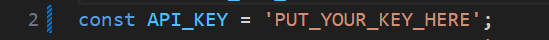

---

# Dynamic Weather div

This project provides a customizable weather widget that can be easily embedded into any webpage. The widget allows users to enter a city name or coordinates to fetch and display the average temperature, wind speed, and humidity for each day of the week over the next two weeks. Additionally, the widget includes an icon for each day that visually represents the current weather condition, such as sunny, cloudy, rainy, or snowy, providing users with a quick and intuitive overview of the forecast.


## Features

- **City or Coordinates Input:** Users can enter either a city name or geographical coordinates to retrieve the weather data.
- **Two-Week Weather Forecast:** The widget fetches weather data for the next 14 days.
- **Average Temperature Display:** For each day of the week, the widget calculates and displays the average temperature across the two weeks.
- **Average Wind Speed Display:** For each day of the week, the widget calculates and displays the average Wind Speed across the two weeks.
- **Average Humidity Display:** For each day of the week, the widget calculates and displays the average Humidity across the two weeks.
- **Dynamic Div Injection:** The script can inject the weather widget into a specified div or create a new one if no div ID is provided.
- **Customizable Visuals:** The visual presentation and interactions are designed by me.

## Installation Instructions

### Step 1: create key for weather API

1. go to https://www.visualcrossing.com/
2. sign up (Free Account).
3. navigate to your account.
4. copy the key.
5. put the key in script.js file.





### Step 2: Clone the Repository

Download or clone the project using the following command:

```bash
git clone https://github.com/yourusername/dynamic-weather-div.git
```

### Step 3: Navigate to the Project Directory

Move into the project directory:

```bash
cd dynamic-weather-div
```

### Step 4: Run the Project

Open the `index.html` file in your default browser:

1. Navigate to the root directory of the project.
2. Open the `index.html` file using your preferred method (double-click, right-click and select "Open with," etc.).
3. The project will automatically run in your default browser, displaying the weather widget.

## Usage

### Embedding the Weather Widget in Your Webpage

To use the weather widget in your own webpage, follow these steps:

1. **Include the Stylesheet:**
   - Link the `styles.css` file in the `<head>` section of your HTML document to apply the necessary styles to the widget.
   
   ```html
   <link rel="stylesheet" href="path_to_styles.css">
   ```

2. **Add the Weather Widget Div:**
   - Add a `<div>` element with the ID `weather-widget` to your HTML document where you want the widget to appear.

   ```html
   <div id="weather-widget"></div>
   ```

3. **Include the JavaScript File:**
   - Link the `script.js` file at the end of the `<body>` section of your HTML document to load the weather widget's functionality.
   
   ```html
   <script src="path_to_script.js"></script>
   ```

4. **Initialize the Weather Widget:**
   - The `script.js` will automatically populate the `#weather-widget` div with the weather data once the page is loaded.

### Example of Complete HTML Setup

Here’s an example of how your HTML file might look when embedding the weather widget:

```html
<!DOCTYPE html>
<html lang="en">
<head>
    <meta charset="UTF-8">
    <meta name="viewport" content="width=device-width, initial-scale=1.0">
    <title>Weather Widget</title>
    <link rel="stylesheet" href="styles.css">
</head>
<body>
    <div id="weather-widget"></div>
    <script src="script.js"></script>
</body>
</html>
```

### Notes:

- **Path Adjustments:** Ensure that the paths to `styles.css` and `script.js` are correct based on your directory structure.
- **Customization:** You can modify the CSS in `styles.css` to change the look and feel of the widget according to your needs.


## Demo

### Input Hebrew Field
 
*Description: Shows the input field where users can enter city names in Hebrew.*

### Input Coordinates Field
 
*Description: Shows the input field where users can enter coordinates.*


